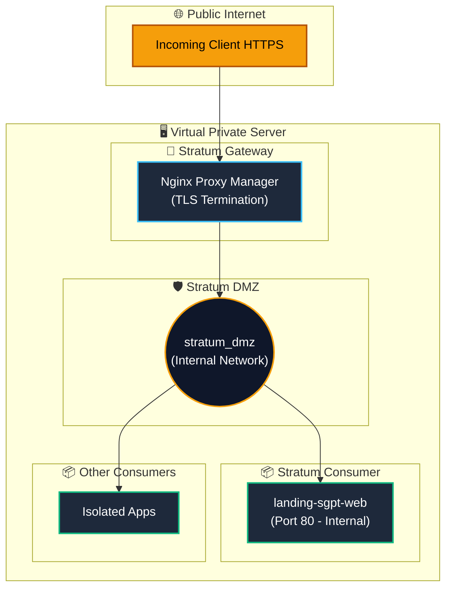

# Landing SGPT — High-Performance Static Infrastructure Service

[](https://nginx.org)
[](https://www.docker.com/)
[](https://github.com)
[](SECURITY.md)
[](LICENSE)
[](https://sandrapuerto.com)

High-performance, zero-dependency static web delivery service engineered under the **Stratum Consumer Architecture Pattern**. Built with vanilla web standards (HTML5, CSS3, JavaScript ES6+), encapsulated within a hardened, immutable Nginx container, and optimized for sub-millisecond static asset delivery behind reverse proxy gateways (such as Nginx Proxy Manager).

---

## 1. Architectural Overview

This component operates strictly as a **Stratum Consumer**:
* **Zero Infrastructure Provisioning:** It does not create or manage global networks; it attaches to the shared platform DMZ (`stratum_dmz`) as an external consumer.
* **Non-Exposed Host Ports:** All incoming traffic is routed internally through isolated bridge networks via the central gateway, eliminating host port collisions.
* **Deterministic Immutability:** The web server runs with an immutable, read-only root filesystem (`read_only: true`), temporary in-memory mounts (`tmpfs`), and dropped Linux capabilities.



---

## 2. Directory Structure

```
landing-sgpt/
├── .env.example          # Template for environment configuration
├── .gitignore            # Git exclusion rules (secrets, OS, caches)
├── docker-compose.yml    # Hardened container orchestration specification
├── LICENSE               # MIT open-source license
├── README.md             # Technical documentation and operations guide
├── SECURITY.md           # Security policy and disclosure process
├── CONTRIBUTING.md       # Contribution guidelines and standards
├── nginx/
│   ├── nginx.conf        # Tuned event-loop, rate limiting & compression
│   └── conf.d/
│       └── default.conf  # Server block, security headers (CSP) & cache rules
├── templates/
│   ├── 404.html          # Out-of-tree 404 error page (isolated from public webroot)
│   └── maintenance.html  # Standalone fallback & maintenance template for NPM
├── scripts/
│   ├── generate_assets.py # Favicons (ICO, PNG, SVG) and OG social banner generator
│   └── version_assets.py # Content-hash cache busting (?v=) for CSS/JS references
└── public/
    ├── index.html        # Main landing page (CSS keyframes, zero JS blocking)
    ├── manifest.json     # Progressive web manifest
    ├── robots.txt        # Web crawler directives
    ├── sitemap.xml       # Canonical search engine index map
    ├── llms.txt          # LLM crawler summary and context specifications
    ├── humans.txt        # Author, standards and tooling declarations
    ├── css/
    │   └── styles.css    # Central design system (variables, glassmorphism, responsive)
    ├── js/
    │   └── app.js        # Fully documented runtime logic, observer & handlers
    ├── icons/            # Brand icons (SVG, ICO, PNG 16x16, 32x32, 180x180, 192x192, 512x512)
    └── images/           # High-resolution social media banners (og-image.png)
```

---

## 3. Performance & Core Web Vitals

The frontend is intentionally designed without heavyweight frameworks or bloated runtime dependencies to achieve near-perfect Lighthouse scores:

* **Zero-Runtime Overhead:** Pure Vanilla HTML5, modern CSS3 (`clamp()`, CSS Grid, Flexbox, custom properties), and vanilla ES6+.
* **Immediate First Contentful Paint (FCP):** Critical above-the-fold layout and typography are animated via CSS keyframes (`@keyframes animateIn`), eliminating JavaScript render-blocking.
* **Deferred Script Execution:** Scripts (`app.js`) utilize the `defer` attribute, offloading interaction observers and dynamic bindings past the initial render cycle.
* **Immutable Caching + Content Hashing:** Static assets (`css`, `js`, `svg`, `png`, ...) are served with `Cache-Control: public, max-age=604800, immutable`. Because they are immutable for browsers and the Cloudflare edge, every CSS/JS reference in HTML carries a `?v=<sha256>` fingerprint generated by `scripts/version_assets.py`. A content change produces a new URL, so no cache purge is ever required. HTML is served with `max-age=0, must-revalidate`.
* **Readable Sources:** Sources are never minified in place. Nginx `gzip` compresses responses on the fly, which yields practically the same transfer size as minification for files of this size.

---

## 4. Container Security Posture

The Docker container specification implements defense-in-depth principles:

| Security Measure | Implementation | Objective |
| :--- | :--- | :--- |
| **Read-Only Root Filesystem** | `read_only: true` | Prevents runtime tampering or modification of application files. |
| **Capability Dropping** | `cap_drop: [ALL]` | Strips all Linux privileges; explicitly adds only minimal execution capabilities (`CHOWN`, `DAC_OVERRIDE`, `SETGID`, `SETUID`, `NET_BIND_SERVICE`). |
| **Privilege Escalation Block** | `no-new-privileges:true` | Disallows sub-processes from acquiring new privileges at runtime. |
| **Ephemeral Memory Storage** | `tmpfs` mounts | Routes `/var/cache/nginx`, `/var/run`, and `/tmp` to volatile memory limits. |
| **Strict HTTP Method Filter** | `GET`, `HEAD`, `OPTIONS` only | Rejects `POST`, `PUT`, `DELETE`, `PATCH` with HTTP `405 Method Not Allowed`. |
| **Content Security Policy (CSP)**| Strict directives | Restricts script sources to `'self'`, enforces HTTPS font delivery, and blocks framing (`frame-ancestors 'none'`). |

---

## 5. Deployment & Configuration

### Prerequisites
* Docker Engine 24.0+
* Docker Compose v2.20+
* An operational external Docker network (e.g., `stratum_dmz`)

### Step 1: Environment Setup
Copy the configuration template:
```bash
cp .env.example .env
```

Review the values in `.env`:
```ini
# Timezone identifier
TZ=America/Bogota

# Shared DMZ external network name
STRATUM_DMZ_NETWORK=stratum_dmz
```

### Step 2: Deployment
Launch the service using Docker Compose:
```bash
docker compose up -d
```

Verify service health:
```bash
docker compose ps
docker compose logs -f
```

### Step 3: Gateway Configuration (Nginx Proxy Manager)
In the NPM administrative dashboard, create a new **Proxy Host**:
* **Domain Names:** `your-domain.com`
* **Scheme:** `http`
* **Forward Hostname / IP:** `landing-sgpt-web`
* **Forward Port:** `80`
* **Block Common Exploits:** `Enabled`
* **Websockets Support:** `Enabled` (optional)
* **SSL:** Request a Let's Encrypt certificate and enable `Force SSL` / `HTTP/2 Support`.

---

## 6. Default Fallback & Maintenance Integration

The project provides a self-contained, standalone fallback template at [`templates/maintenance.html`](templates/maintenance.html) containing embedded CSS and vector graphics.

To configure NPM default host fallback:
1. Navigate to **NPM Settings &rarr; Default Site**.
2. Select **Custom Page**.
3. Copy and paste the contents of [`templates/maintenance.html`](templates/maintenance.html) into the HTML field.

---

## 7. Development & Cache Busting

Local development can be performed using any standard static server (e.g., VS Code Live Server or Python HTTP module):

```bash
# Preview locally
python -m http.server 8000 -d public/
```

**Mandatory before every commit that touches CSS/JS:** refresh the asset fingerprints.
```bash
python scripts/version_assets.py          # rewrites ?v=<hash> in HTML (idempotent)
python scripts/version_assets.py --check  # CI / pre-commit: exits 1 if stale
```

> Skipping this step means browsers and Cloudflare keep serving the previous CSS/JS for up to 7 days, because those files are cached as `immutable`.

---

## 8. Author & Architectural Provenance

**Landing SGPT** was engineered by **Sandra Gabriela Puerto Torres** under the Stratum ecosystem design principles.

* **Role:** Backend Developer & Technical Infrastructure Director
* **Core Philosophy:** *High-performance, zero-dependency components leveraging robust container hardening and isolation.*
* **Website:** [https://sandrapuerto.com](https://sandrapuerto.com)

---

## 9. License

This repository is distributed under an enhanced MIT License with a mandatory private security vulnerability disclosure requirement. See [LICENSE](LICENSE) for full legal text.
